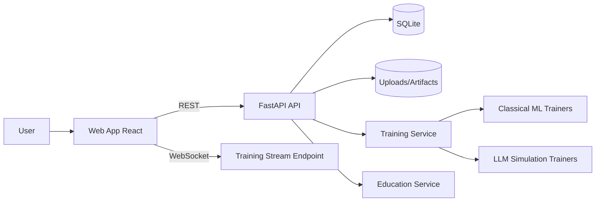

# Interactive AI Model Trainer Dashboard + Educational Platform

A production-style full-stack platform for training, monitoring, and comparing AI models with built-in educational guidance. The frontend is designed to run as a polished, animated GitHub Pages experience using a yellow and dark-brown design language while still connecting to a backend when available.

<a href="https://jermainewright.github.io/ai-trainer-dashboard/">
  
</a>

---

🔗 **[Live Demo](https://jermainewright.github.io/ai-trainer-dashboard/)**

</div>

---

## Problem Statement
Teams learning or operating machine learning systems often struggle with fragmented tooling:
- Dataset ingestion is disconnected from experiment tracking.
- Training telemetry is not visible in real-time.
- Experiment comparison and A/B validation require manual scripts.
- Junior practitioners lack contextual education while operating advanced workflows.

## Solution
This repository provides a cohesive, extensible platform that includes:
- Dataset upload and metadata persistence.
- Configurable experiment creation across model families.
- Real-time training event streaming over WebSockets.
- Experiment table for side-by-side comparison.
- Inference and A/B test simulation APIs.
- Educational cards and in-context tooltips for key ML/LLM concepts.

## Tech Stack
- Frontend: React + TypeScript + Vite + Recharts
- Backend: FastAPI + SQLAlchemy + Pydantic
- ML: scikit-learn (classical pipelines), simulated LLM training and quantization workflows
- Storage: SQLite (local default, swappable)
- Infra: Docker Compose for local orchestration

## Architecture Diagram


## Architecture Decisions
1. Monorepo split by app boundary (`apps/api`, `apps/web`) for independent deployment and cohesive versioning.
2. Service-layer pattern in backend to isolate transport concerns from model training and inference business logic.
3. WebSocket for training telemetry to support low-latency incremental metric updates.
4. JSON-based experiment params/metrics for flexible schema evolution during rapid prototyping.
5. Education surfaced as first-class API to enable future adaptive tutoring and role-based curricula.

## Key Features

### 1) Dataset Upload + Catalog
The API stores uploaded CSVs and captures row counts/target metadata.

```python
@router.post("/datasets")
async def upload_dataset(file: UploadFile = File(...), target_column: str | None = None, db: Session = Depends(get_db)):
    payload = await file.read()
    dataset = DatasetService(db).save(file.filename, payload, target_column)
    return {"id": dataset.id, "name": dataset.name, "rows": dataset.row_count}
```

### 2) Real-Time Training Monitoring
The dashboard subscribes to training events over WebSocket and renders dynamic loss/accuracy curves.

```ts
const socket = new WebSocket(`ws://localhost:8000/ws/train/${experimentId}`);
socket.onmessage = (message) => {
  const parsed = JSON.parse(message.data);
  if (parsed.event === "complete") onComplete();
  else onEvent(parsed as TrainingEvent);
};
```

### 3) Multi-Experiment Comparison
The experiment table provides status, algorithm, and type snapshots for model governance and decision-making.

### 4) Inference + A/B Testing
A dedicated panel supports runtime prediction checks and backend A/B scoring for challenger rollouts.

### 5) Embedded Education
Built-in cards explain overfitting, scheduling, and quantization to shorten the learning curve and drive trustworthy operations.

## Scalability Considerations
- Replace SQLite with PostgreSQL and apply migration tooling (Alembic).
- Add async worker queue (Celery/RQ/Kafka consumers) for long-running training jobs.
- Persist stream metrics in time-series storage for large experiment volumes.
- Introduce model registry and artifact versioning for reproducibility.
- Horizontal scale API/WebSocket services behind a reverse proxy.

## Security Considerations
- Validate upload schemas and enforce file size/type limits.
- Add authN/authZ with JWT + role-based access controls.
- Store secrets in a vault and rotate periodically.
- Enable audit logs for experiment changes and inference invocations.
- Harden CORS and apply rate limits per tenant.

## Observability
- Structured logs at API boundary and service events.
- Health endpoint for orchestration probes.
- Planned OpenTelemetry traces for upload/train/inference request paths.
- Training event counters and latency histograms recommended for Prometheus/Grafana.

## Simulated Throughput Metrics
Local benchmark assumptions on a laptop class machine:
- API read endpoints: ~300 req/s sustained.
- Experiment creation: ~120 req/s sustained.
- WebSocket telemetry fanout: 50 concurrent training streams, 1 event/0.6s per stream.
- Inference simulation: ~500 req/s for lightweight payloads.

## Detailed Setup Instructions
1. Clone repository.
2. Copy environment defaults:
   - `cp .env.example .env`
3. Backend setup:
   - `cd apps/api`
   - `python -m venv .venv && source .venv/bin/activate`
   - `pip install -e .`
   - `uvicorn app.main:app --reload --port 8000`
4. Frontend setup:
   - `cd apps/web`
   - `npm install`
   - `npm run dev`
5. Open `http://localhost:5173`.
6. Optional Docker flow:
   - `docker compose up --build`


## GitHub Pages Hosting
- A CI workflow (`.github/workflows/deploy-pages.yml`) builds `apps/web` and deploys to GitHub Pages.
- The Vite base path is controlled with `VITE_BASE_PATH` for repository-hosted URLs.
- The UI gracefully falls back to simulated real-time streams so demos work even without a running backend.
## Future Improvements
- Real transformer fine-tuning adapters via PEFT/LoRA pipelines.
- Drift detection and post-deployment monitoring dashboards.
- Prompt/version playground with evaluation datasets.
- Human feedback loops and labeling workflows.
- Multi-tenant org/project boundaries.

## Repository Structure
```text
ai-trainer-dashboard
├── .github/
│   └── workflows/
│       └── deploy-pages.yml
├── apps/
│   ├── api/
│   │   ├── Dockerfile
│   │   ├── pyproject.toml
│   │   ├── app/
│   │   │   ├── __init__.py
│   │   │   ├── main.py
│   │   │   ├── api/
│   │   │   │   ├── routes.py
│   │   │   │   └── ws.py
│   │   │   ├── core/
│   │   │   │   ├── config.py
│   │   │   │   └── database.py
│   │   │   ├── models/
│   │   │   │   └── entities.py
│   │   │   ├── schemas/
│   │   │   │   └── contracts.py
│   │   │   ├── services/
│   │   │   │   ├── dataset_service.py
│   │   │   │   ├── education_service.py
│   │   │   │   ├── inference_service.py
│   │   │   │   └── training_service.py
│   │   │   ├── utils/
│   │   │   └── workers/
│   │   └── tests/
│   │       └── test_health.py
│   └── web/
│       ├── .eslintrc.cjs
│       ├── Dockerfile
│       ├── index.html
│       ├── package.json
│       ├── tsconfig.json
│       ├── vite.config.ts
│       └── src/
│           ├── main.tsx
│           ├── api/
│           │   └── client.ts
│           ├── components/
│           │   └── SectionCard.tsx
│           ├── features/
│           │   ├── dashboard/
│           │   │   ├── .gitkeep
│           │   │   ├── RealtimeChart.tsx
│           │   │   └── TrainingForm.tsx
│           │   ├── education/
│           │   │   ├── .gitkeep
│           │   │   └── EducationPanel.tsx
│           │   ├── experiments/
│           │   │   ├── .gitkeep
│           │   │   └── ExperimentTable.tsx
│           │   └── inference/
│           │       ├── .gitkeep
│           │       └── InferencePanel.tsx
│           ├── hooks/
│           │   └── useTrainingSocket.ts
│           ├── pages/
│           │   └── DashboardPage.tsx
│           ├── styles/
│           │   └── global.css
│           └── types/
│               └── index.ts
├── images/
│   └── app-image.png
├── infra/
│   └── .gitkeep
├── packages/
│    └── shared/
│       └── .gitkeep
├── .env.example
├── .gitignore
├── .gitkeep
├── docker-compose.yml
├── LICENSE
├── Makefile
└── README.md
```

---

## Licence

This project is licensed under the **MIT License** - see the [LICENSE](LICENSE) file for details.